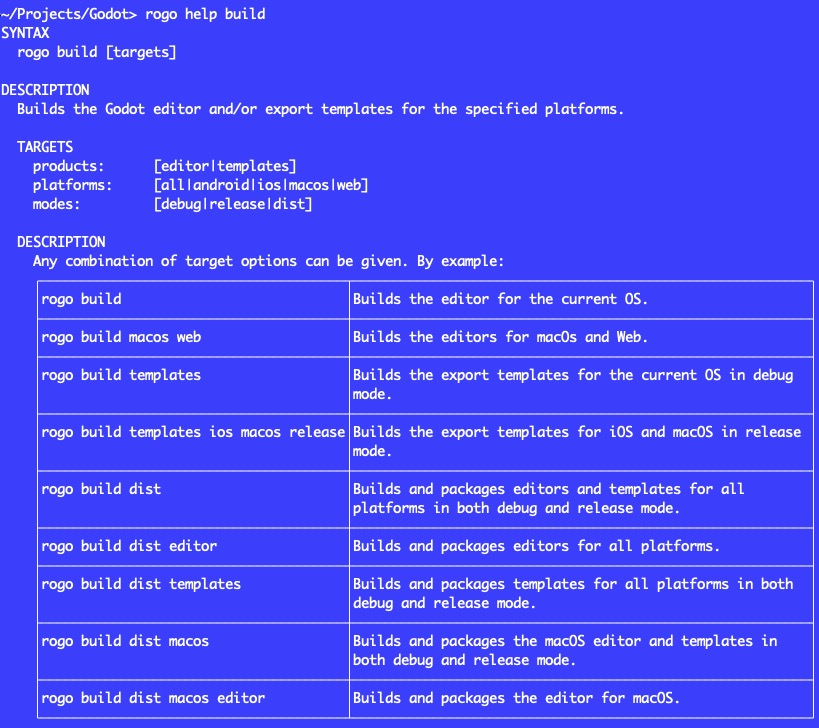

# RoGodot
Rogo-based buildscript to supplement Godot's SCons-based build system.

About     | Current Release
----------|-----------------------
Version   | 0.1 (in development)
Date      | July 4, 2023
Platforms | Windows, macOS, Linux
License   | [MIT License](LICENSE)

# Usage

    > rogo help

    USAGE
      rogo build [targets]             Builds the Godot editor and/or export templates for the specified platforms.
      rogo clean                       Deletes the 'bin', 'Build' and '.rogo' folders.
      rogo default                     Builds and runs the editor for the current platform.
      rogo deps                        Installs any missing dependencies (specifically: MoltenVK on macOS).
      rogo dist                        Shorthand for 'rogo build dist'
      rogo help [command]              Displays help for a specified command or else all build commands.
      rogo run                         Runs the most recent editor build for the current platform.
      rogo version [version [status]]  Displays or changes the Godot version number in all applicable files.

# Description
Supplements Godot's existing SCons-based build system with additional convenience functionality.

- Automatically installs and builds MoltenVK dependency on macOS.
- Simple, flexible build syntax. For example, `rogo build templates ios macos release` builds the export templates for iOS and macOS in release mode.
- `rogo` by default builds and runs the editor for the current OS.
- If a file `Local.rogo` exists and defines a project path `AUTLAUNCH = "path/to/godot/project"`, that project will be automatically loaded when `rogo` or `rogo run` is executed.

# Installation
1. Install [Rogo](https://github.com/brombres/Rogo).
2. Clone the [Godot engine repo](https://github.com/godotengine/godot) and `git checkout` your preferred version branch, e.g. `4.0`.
3. Copy [BuildCore.rogue](BuildCore.rogue) to the Godot repo.
4. Run `rogo`, `rogo help`, etc.
5. Optionally add the following files to `.gitignore`:

        # Rogo
        .rogo
        Local.rogo
        BuildLocal.rogue

# Reference
- RoGodot development repo: [https://github.com/brombres/godot/tree/feature/rogodot](https://github.com/brombres/godot/tree/feature/rogodot).
